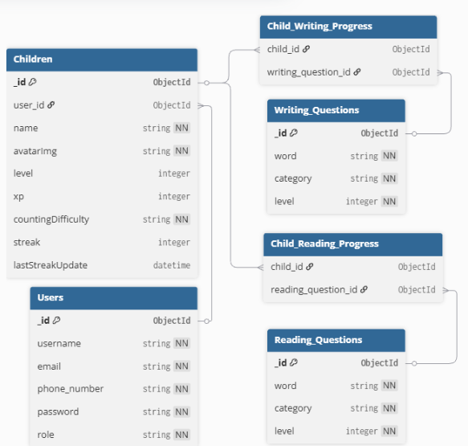

# CalisFun Backend Repository Documentation

---

## 📃 Table of Contents
- [⚙️ Technology Stack](#-technology-stack)
- [🧩 List of APIs](#-list-of-apis)
- [🛡️ Autentikasi](#-autentikasi)
- [🚀 Live Demo](#-live-demo)
- [🏗️ Architecture Pattern](#-architecture-pattern)
- [🎨 Design Pattern](#-design-pattern)
- [🧼 Clean Code Principles](#-clean-code-principles)
- [🔒 Security Implementation](#-security-implementation)
- [📝 CI/CD](#-cicd)
- [🧪 Test Coverage & Strategy](#-test-coverage--strategy)
- [🔐 .env Configuration](#-env-configuration)
- [🧰 Getting Started Locally](#-getting-started-locally)
- [🧭 Diagram](#-diagram)
- [🔥 API Documentation](#-api-documentation)
- [👥 Owner](#-owner)
- [📬 Contact](#-contact)

---

## ⚙️ Technology Stack

<div align="center">

<kbd></kbd>
<kbd></kbd>
<kbd></kbd>
<kbd></kbd>
<kbd></kbd>
<kbd></kbd>
<kbd></kbd>

</div>

<div align="center">
<h4>Node JS | Express JS | MongoDB | JWT | Multer | Vercel | Microsoft Azure</h4>
</div>

---

## 🧩 List of APIs

### Authentication
<details>
<summary>Lihat Endpoint</summary>

- **POST** `/auth/register` → Mendaftarkan pengguna baru _(Publik)_  
- **POST** `/auth/login` → Login untuk mendapatkan JWT _(Publik)_  
- **PUT** `/auth/change-password/:id` → Mengubah password pengguna _(Terotentikasi)_  
- **POST** `/auth/logout` → Logout dan memasukkan token ke blacklist _(Terotentikasi)_  

</details>

---

### User
<details>
<summary>Lihat Endpoint</summary>

- **GET** `/user/profile` → Mendapatkan profil pengguna yang sedang login _(Terotentikasi)_  
- **GET** `/leaderboard` → Mendapatkan data leaderboard _(Terotentikasi)_  

</details>

---

### Child Management
<details>
<summary>Lihat Endpoint</summary>

- **POST** `/children/create` → Membuat profil anak baru (termasuk unggah avatar) _(Terotentikasi)_  
- **GET** `/children/all` → Mendapatkan semua profil anak milik pengguna _(Terotentikasi)_  
- **GET** `/children/one/:childId` → Mendapatkan detail satu profil anak _(Terotentikasi)_  
- **PUT** `/children/update/:childId` → Memperbarui profil anak (termasuk unggah avatar) _(Terotentikasi)_  
- **PUT** `/children/streak/:childId` → Memperbarui streak harian anak _(Terotentikasi)_  
- **DELETE** `/children/delete/:childId` → Menghapus profil anak _(Terotentikasi)_  
- **PUT** `/children/counting-difficulty/:childId` → Memperbarui tingkat kesulitan berhitung _(Terotentikasi)_  
- **GET** `/images/:id` → Mendapatkan gambar avatar _(Publik)_  

</details>

---

### Reading & Writing Questions
<details>
<summary>Lihat Endpoint</summary>

- **GET** `/reading/all` → Mendapatkan semua soal membaca _(Terotentikasi)_  
- **GET** `/reading/user/:childId` → Mendapatkan soal membaca sesuai progres anak _(Terotentikasi)_  
- **POST** `/reading/progress/:childId` → Memperbarui progres membaca anak _(Terotentikasi)_  

- **GET** `/writing/all` → Mendapatkan semua soal menulis _(Terotentikasi)_  
- **GET** `/writing/user/:childId` → Mendapatkan soal menulis sesuai progres anak _(Terotentikasi)_  
- **POST** `/writing/progress/:childId` → Memperbarui progres menulis anak _(Terotentikasi)_  

</details>

---

### Chatbot & Statistics
<details>
<summary>Lihat Endpoint</summary>

- **POST** `/chat` → Mengirim pesan ke AI Chatbot _(Publik)_  
- **GET** `/children/stats/:childId` → Mendapatkan statistik progres anak _(Terotentikasi)_  
- **GET** `/questions/stats` → Mendapatkan statistik jumlah soal _(Admin)_  

</details>

---

### Admin Only
<details>
<summary>Lihat Endpoint</summary>

- **GET** `/users/all` → Mendapatkan semua data pengguna _(Admin)_  

**Reading CRUD:**  
- **POST** `/reading/create`  
- **PUT** `/reading/update/:id`  
- **DELETE** `/reading/delete/:id`  
Operasi CRUD soal membaca _(Admin)_  

**Writing CRUD:**  
- **POST** `/writing/create`  
- **PUT** `/writing/update/:id`  
- **DELETE** `/writing/delete/:id`  
Operasi CRUD soal menulis _(Admin)_  

</details>

---

## 🛡️ Autentikasi
- Gunakan **Bearer Token (JWT)** pada `Authorization Header` untuk semua endpoint yang membutuhkan autentikasi.
- Format: Authorization: Bearer <your_token>

---

## 📌 Catatan
- **Publik** → bisa diakses tanpa login.  
- **Terotentikasi** → membutuhkan login (JWT).  
- **Admin** → hanya bisa diakses oleh user dengan role `admin`.  

## 🚀 Live Demo

👉 [https://calis-fun-backend.vercel.app/](https://calis-fun-backend.vercel.app/)

---

## 🏗️ Architecture Pattern

### Repository Structure

```
calis-fun-be/
├── .github/                    # GitHub workflows / CI configuration
├── Backend/                    # Main source code
│   ├── config/                 # Database & environment configuration
│   ├── controllers/            # Request handlers (business orchestration)
│   ├── helper/                 # Helper functions (utilities, reusable logic)
│   ├── middleware/             # Express middlewares (auth, validation, error handling)
│   ├── models/                 # Database models (MongoDB/Mongoose schemas)
│   ├── routes/                 # Route definitions and API mapping
│   ├── seeders/                # Database seed scripts (initial data)
│   └── tests/                  # Unit & integration tests (Jest + Supertest)
│
├── node\_modules/              # Dependencies (auto-generated)
├── coverage/                   # Coverage (auto-generated)
├── server.js                   # Application entry point (Express server)
│
├── .env                        # Environment variables (local)
├── .env.example                # Sample environment file
├── .env.test                   # Environment variables for testing
├── .gitignore                  # Git ignore rules
├── babel.config.cjs            # Babel configuration
├── jest.config.cjs             # Jest testing configuration
├── package.json                # Project metadata & dependencies
├── package-lock.json           # Locked dependency tree
├── README.md                   # Repository documentation
└── vercel.json                 # Vercel deployment configuration
```

### **Architecture Principles**

The architecture for the **CalisFun Backend** follows a **Layered MVC Architecture**, designed for **clarity, scalability, and testability**.

1. **Layered Architecture Pattern**
   - **Presentation Layer (API Layer):**  
     `routes/` + `middleware/`  
     Defines all API endpoints and request/response handling. Middleware secures routes (JWT, validation, error handling).
   
   - **Application Layer (Controllers):**  
     `controllers/`  
     Orchestrates business logic, connects services, and prepares responses for clients.
   
   - **Domain Layer (Business & Models):**  
     `models/` + `helper/`  
     Contains the data schema (MongoDB via Mongoose) and domain logic (validation, utilities).
   
   - **Infrastructure Layer (Config & Persistence):**  
     `config/` + `seeders/`  
     Handles database connection, environment setup, and initial dataset seeding.

2. **Model–View–Controller (MVC) Principles**
   - **Model:** Represents the database schema and rules (`models/`).  
   - **Controller:** Encapsulates business logic and response handling (`controllers/`).  
   - **View:** Instead of HTML views, the backend serves **JSON responses** as the "view" layer for the mobile/web frontend.

3. **Separation of Concerns**
   - **`routes/`** → Handles endpoint mapping.  
   - **`controllers/`** → Business logic orchestration.  
   - **`models/`** → Data definition and persistence.  
   - **`middleware/`** → Security, validation, and error control.  
   - **`helper/`** → Utility functions reused across layers.  

4. **Scalability in Mind**
   - Organized in modular domains → easy to add new features (e.g., new quiz type, new role).  
   - `tests/` ensures new changes don’t break existing functionality.  
   - CI/CD integrated with GitHub Actions and Vercel for automatic deployments.

5. **Express.js + MongoDB Stack**
   - `server.js` initializes Express app and applies routes/middlewares.  
   - `Mongoose` provides ODM for MongoDB with schema validation.  
   - `Jest + Supertest` ensure testability of routes, controllers, and middleware.  

---

## 🎨 Design Pattern

### 🔨 Creational Patterns
- **Singleton Pattern**  
  - Applied in database connection (`config/db.js`) to ensure only **one instance** of the MongoDB connection is created and reused.  
  - Prevents multiple connections and improves performance.  

- **Factory Pattern**  
  - Used in `models/` where Mongoose schemas generate model instances (e.g., `User`, `Quiz`, `Progress`).  
  - Ensures consistent creation of objects that interact with MongoDB.  

### 🏗️ Structural Patterns
- **Module Pattern**  
  - Code is organized into self-contained modules (`controllers/`, `routes/`, `middleware/`, `helper/`).  
  - Each module handles a single responsibility and can be extended independently.  

- **Facade Pattern**  
  - `controllers/` act as a facade between incoming HTTP requests and deeper logic (models, services).  
  - Provides a simplified API to the routes layer, hiding database or service complexity.  

- **Proxy Pattern**  
  - Implemented in middleware (e.g., `authMiddleware`) to intercept and validate requests before reaching controllers.  
  - Adds security and logging behavior transparently.  

### 🤝 Behavioral Patterns

- **Middleware Chain (Chain of Responsibility Pattern)**  
  - Express middlewares (auth, validation) form a **chain of responsibility**.  
  - Each middleware decides whether to handle the request or pass it to the next one.  

---

## 🧼 Clean Code Principles

To ensure maintainability, scalability, and readability, the **CalisFun Backend** follows Clean Code practices:

- **Naming Conventions**  
  - Follows **camelCase** for variables & functions, **PascalCase** for models, and **UPPER_CASE** for constants/environment variables.  
  - Example: `userController.js`, `authMiddleware.js`, `UserModel`.  

- **Small & Focused Modules**  
  - Each folder (controllers, routes, middleware, models) has a **single responsibility**.  
  - Example: `authController` only handles login/register, `quizController` only manages quiz-related endpoints.  

- **Consistent Project Structure**  
  - Organized in layered MVC pattern: `routes → controllers → models → database`.  
  - Utilities/helpers are isolated in `/helper` to avoid duplication.  

- **Linting & Formatting**  
  - Enforced with **ESLint** and **Prettier** for consistent code style.  

- **Error Handling**  
  - Ensures all errors return consistent JSON responses.  

- **Testing**  
  - Unit and integration tests live in `/tests` (Jest + Supertest).  
  - Covers critical flows like authentication, CRUD operations, and role-based access.  

- **Separation of Concerns**  
  - `routes/` define endpoints only.  
  - `controllers/` orchestrate business logic.  
  - `models/` manage data schema & persistence.  
  - `middleware/` add reusable cross-cutting concerns (auth, validation).  

---

## 🔒 Security Implementation

The **CalisFun Backend** implements multiple security mechanisms to protect data and users:

- **JWT Authentication**  
  - All protected routes require a valid **JSON Web Token (JWT)**.  
  - Tokens are signed with a secret key stored in environment variables.  

- **Role-Based Access Control (RBAC)**  
  - Roles like **Admin** and **User** are enforced.  
  - Example: Only Admin can manage questions, while Users can only access their own progress.  

- **Input Validation & Sanitization**  
  - Prevents SQL/NoSQL injections and invalid payloads.  

- **Secure Communication**  
  - All API endpoints are served via **HTTPS** (handled at deployment level with Vercel/Reverse Proxy).  
  - Secrets (DB URI, JWT_SECRET, API Keys) are injected from `.env`, never hardcoded.  

- **Error & Logging Security**  
  - Logs only necessary details for debugging.  

- **Middleware Security**  
  - Authentication middleware ensures only authorized requests reach controllers.  
  - Rate limiting and CORS can be configured for extra protection.  

- **Dependency & Vulnerability Checks**  
  - Regular `npm audit` to detect vulnerable packages.    

---


## 📝 CI/CD

The CI/CD pipeline for **CalisFun Backend** is designed to ensure **automation, code quality, and reliable deployment**:

- **GitHub Actions (Workflows)**  
  - Runs **unit + integration tests** with **Jest + Supertest** on every `main` branch push.   
  - Generates **test coverage reports** under `the root /coverage directory`.  

- **Vercel Deployment**  
  - Integrated with **Vercel** for backend hosting.  
  - Every push to the `main` branch triggers an **automatic build & deployment** to production.  
  - Preview deployments are created for each pull request → enabling QA and developer review before merging.  

**CI/CD Flow:**  
1. Developer pushes code → GitHub Actions runs tests.  
2. If pipeline passes, Vercel automatically deploys the latest version.  
3. Production API is updated instantly with **zero-downtime deployment**.  

---

## 🧪 Test Coverage & Strategy

CalisFun Backend employs a **multi-layered testing strategy** to ensure stability, security, and reliability for every API endpoint.  
We leverage **Jest** as our primary framework for running tests and monitoring code health.

---

### 🔍 Testing Scope

Currently, our main focus is on **Integration Tests** to validate critical API workflows.

#### Integration Tests (API Endpoints)

- **Supertest** → performs HTTP requests against each endpoint and validates responses (status codes, body, headers).  
- **MongoDB Memory Server** → creates an isolated, in-memory database for each test session. This ensures tests are independent of the development database and run in a clean environment.

#### ✅ Tested Flows
- **Authentication Flow**:  
  User registration, login (valid & invalid credentials), and logout process.  
- **Authorization Flow**:  
  Access verification using JWT and handling of invalid/missing tokens.  
- **Child Management (CRUD)**:  
  Creating, reading, updating, and deleting child data associated with a parent account.  
- **Exercise Flow**:  
  Fetching exercise questions (reading) and submitting progress answers.  

---

### 📊 Coverage Metrics & Reporting

Code coverage reports are automatically generated after each test run to provide a clear overview of which parts of the codebase have been tested.

- **Tools**: Generated by Jest  
- **Location**: `/coverage` directory  

#### Metrics Tracked
- **Statements** → percentage of executed code statements  
- **Branches** → percentage of tested logical branches (`if/else`, `catch` blocks, etc.)  
- **Functions** → percentage of invoked functions  
- **Lines** → percentage of executed lines of code  

---

### 📈 Current Coverage Status
- Overall coverage: **> 55%**  
- **Models & Routes**: 100% coverage  
- **Controllers**: in progress → focus on error-handling scenarios & edge cases  

We are continuously working to improve these metrics, with the primary goal of achieving more robust coverage in all layers.


---

## 🔐 .env Configuration

.env for the Backend
```
MONGO_URI=<mongo_db_url/>
JWT_SECRET=
PORT=3000
NODE_ENV=development
FRONTEND_URL=http://localhost:5173

AZURE_OPENAI_KEY=<azure_open_ai_key_subscription/>
AZURE_OPENAI_ENDPOINT=<azure_open_ai_endpoint/>
AZURE_API_VERSION=2024-12-01-preview
AZURE_OPENAI_DEPLOYMENT=gpt-35-turbo
```

You can also copy the .env.sample then rename it to .env

---

## 🧰 Getting Started Locally

### Prerequisites
- **Node.js** (v16+)
- **MongoDB**
- **Git**
- **MongoDB Compass** (optional)
- **Postman** (optional)

### Clone the Project
```bash
git clone https://github.com/best-team-compfest17/CalisFun-Backend.git
cd CalisFun-Backend
cd Backend
npm install
npm run seed:all  # Seeding the database
npm run dev       # Run the local server
npm run test      # Run jest test
```

---

## 🧭 Diagram

*Overall Database System Flow:*
<p align="center">
  
</p>

This diagram shows how the models connected using ERD Diagram

---

## 🔥 API Documentation

Postman Link:

[CalisFun Backend Postman](https://documenter.getpostman.com/view/38889792/2sB3BLj84B)

---

## 👥 Owner

This Repository is created by Team 1
<ul>
<li>Stanley Nathanael Wijaya - Fullstack Developer</li>
<li>Haikal Iman F - Mobile Developer</li>
<li>Muhammad Favian Jiwani - Mobile Developer</li>
<li>Raditya Ramadhan - Backend Developer</li>
<li>Muhammad Ridho Ananda - Mentor</li>
</ul>
As Final Project for SEA Academy Compfest 17

---

## 📬 Contact
Have questions or want to collaborate?

- 📧 Email: stanley.n.wijaya7@gmail.com
- 💬 Discord: `stynw7`

<code>Made with ❤️ by The Calon Best Team</code>
